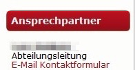

# Homepage Bestand

Die Webseite http://www.ht16.de wurde 2009/2010 mit Drupal 6 entwickelt.

Es gibt zwei eigenständige Unterseiten (Drupal multisite Funktion)

- für das Studio http://studio.ht16.de
- für die Triathlonabteilung http://triathlon.ht16.de

## Inhaltstypen
In der ursprünglichen Installation gab es 17 verschiedene Inhaltstypen. Nach dem Serverumzug 2013 wurden weitere 9 Inhaltstypen erstellt, die alle entweder einen bereits vorhandenen Typ ersetzt oder dupliziert haben. Bei kritischer Betrachtung wären aus derzeitiger Sicht (Anfang 2017) bei vollem Funktionsumfang nur 15 Inhaltstypen erforderlich. Wenn die Inhaltstypen, die ursprünglich für jetzt nicht mehr genutzte Funktionen (Sportzeiten inkl. Suche, Umfragen, HT16 Spiegel, Hilfen für Autoren, HT16 Historie und Raumnutzung) abgezogen werden, müssten eigentlich nur noch 9 Inhaltstypen gepflegt werden. Tatsächlich sind es aber doppelt so viele.

### Seiten, statische Inhalte


### Abteilungen (og)

### Newsbeiträge

### Events / Veranstaltungen

### Ansprechpartner

Enthält alle Informationen zu Personen im Verein, die entweder eine Funktion bekleiden oder als Trainer / Übungsleiter Kontakt für Mitglieder oder Interessierte sind.

Zu erfassende Daten sind der Name, eine E-Mail Adresse (bevorzugt die Vereinsadresse), Telefonnummer und Bereich, für den die Person als Ansprechpartner dient.



Die Telefonnummer und E-Mail Adresse können, müssen aber nicht öffentlich einsehbar sein. Bei verdeckter E-Mail Adresse wird ein Kontaktlink bereitgestellt, über den die Nachricht im System erfasst und dann intern an den Ansprechpartner gesendet wird. Der Absender erhält keine Kenntnis der Adresse (praktisch für private E-Mail Adresse ohne @ht16.de).

### Trainingszeiten

Trainingszeiten bestehen im Wesentlich aus Daten für Anfang und Ende einer Einheit sowie zu Beziehungen zu den weiteren Typen Sportstätten sowie Sportarten in Form der Abteilungszugehörigkeit. Darüber hinaus sind Beschreibung und Trainer vorgesehen, wobei letzteres eine Beziehung zum Inhaltstyp Ansprechpartner sein sollte. Dadurch ist eine Verknüpfung zur Kommunikation möglich, die nur einmal hinterlegt und gepflegt werden muss. Wechselt ein Trainer / Übungsleiter, reicht es, diesen als Ansprechpartner anzulegen und bei der jeweiligen Trainingszeit die Beziehung zu aktualisieren. Man erspart bei zum Teil vielfacher Beteiligung eines Trainers die fehleranfällige Änderung einer großen Anzahl von Trainingszeiten.

### Sportstätten

### Newsletter

### Bildergalerien

Bildergalerien bestehen aus zwei Inhaltstypen: Den Galerien an sich und den eigentlichen Bildern, die so auch zu mehreren Galerien thematisch zugeordnet werden können.

### Nachträge

#### Ferienreisen

## Design

### Farbraum

Die verwendeten Hauptfarben sind:

```css
a:link {
  color: #a10f15;
}
```
