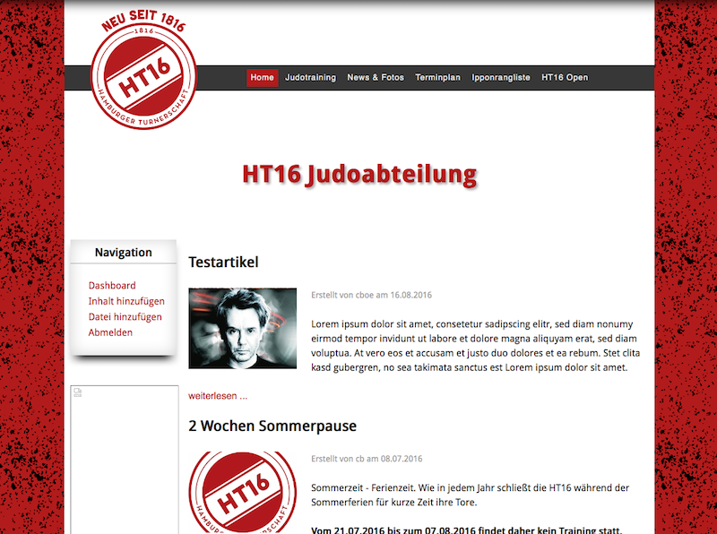

# Design

Beispiele für ein Design der Seite: Bei großer Bildschirmbreite, z.b. bei Desktop Rechnern, Spielkonsolen/Fernseher Kombinationen und Laptops ab 13" mit hoher oder 15" mit normaler Auflösung wird die Breite der Anzeige zwecks Lesefreundlichkeit begrenzt und der verbleibende Raum rechts und links hintergründig gestaltet.

*Desktop Breite*

Sinkt die Bildschirmgröße bzw. reduziert sich die Breite der Anzeige, wird zunächst das Menü in eine unauffällige aber allgemein bekannte Leiste am oberen Rand umgeblendet. Das Vereinslogo wird neu positioniert und die Anzeige auf das Wesentliche beschränkt.

*Schmaler (z.B. Tablet)*

Auf Mobilgeräten mit sehr geringer Breite (z.B. Smartphone hochkant) erfolgt eine weitere Verschlankung der Anzeige.

*Kleine Bildschirme (Mobilgeräte)*

Wichtig dabei ist, dass immer noch alle Informationen vorhanden sind und nur deren Anzeige sich etwas ändert bzw. an die Gegebenheiten der zur Verfügung stehenden Anzeigefläche angepasst werden.
