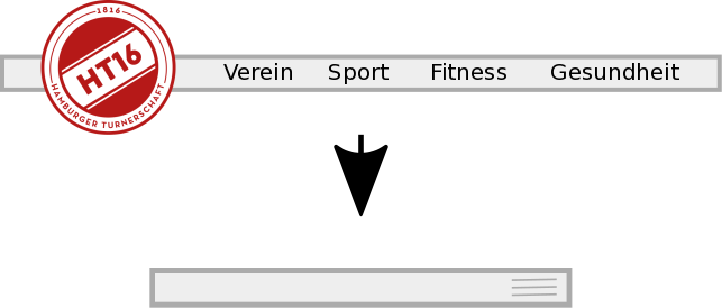
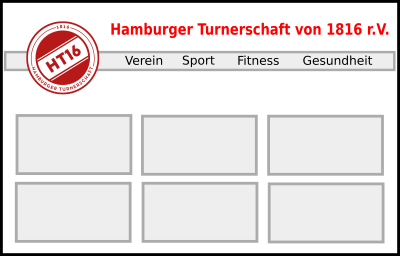
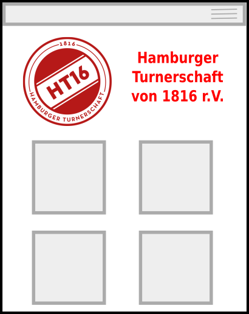
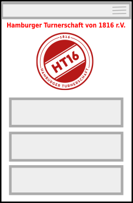

# Informationsarchitektur

Wie sollte die Homepage insgesamt aufgebaut sein, damit die Mitglieder und Interessenten möglichst schnell und einfach an die gesuchten Informationen gelangen?

Wie kann die Homepage aufgebaut sein, um die inhaltliche Pflege den jeweils Verantwortlichen (Hauptverein, Abteilungen) möglichst eingängig und selbsterklärend zu belassen?

Zu diesen Punkten gehören insbesondere der Aufbau der einzelnen Inhaltstypen und die Wiederverwendbarkeit der einmal erstellten Inhalte (Stichwort "chunks vs. blobs") sowie der Aufbau einer intuitiven Navigation, die kein Scrollen durch endlose Listen oder Menüs erfordert und nicht in "Klick-Orgien" ausarten muss, um die gewünschten Informationen zu erreichen.

## Navigation

Die Navigation soll die Besucher gezielt zu ihren Interessen lenken. Dazu darf sie nicht überladen sein und darf zumeist nicht mehr als 4 bis 5 Auswahlmöglichkeiten bieten. Bei richtigem Inhaltsaufbau und Informationsarchitektur ist ein ausuferndes Menü auch nicht erforderlich.

*Menü klassisch und Mobil*

Unterschreitet der verfügbare Bildschirm eine bestimmte Größe (z.B. 1000px), reduziert sich nicht nur die Anzahl der Panels, sondern es wird auch aus dem klassischen Menü eine Menüleiste am oberen Bildschirmrand, die bei Bedarf die Menüpunkte anzeigt. Ansonsten sind die Inhalte über die Panels erreichbar.

## Frontpage, Startseite

Die Startseite muss übersichtlich sein, die wesentlichen Einstiegspunkte für die Navigation und einige wenige Hauptfunktionen bieten.

Mit wenigen Panels gelingt ein unkomplizierter Einstieg in die Seite. Diese Panels können verschiedene Inhalte haben. Mit der Annahme, dass bis zu 6 Panels (Desktop) bzw. 4 Panels (Mobil) gleichzeitig sichtbar sind, können darin großflächig Verweise zu den 4 Hauptbereichen der Seite angezeigt werden:

- (Sport) Wettkampfsport
- Fitness (-studio)
- Gesundheit (-ssport)
- Verein (Verwaltung, Mitgliedschaft etc.)

Die im Desktopbereich aufgrund der Größe weiter sichtbaren 2 Panels könnten dann mit [Überschriften](inhaltselemente.md) der letzten News und mit den kommenden Veranstaltungen gefüllt werden.

Beispiele für die Ansichten:

*Desktop Ansicht der Startseite bei großer Bildschirmanzeige (ab ca. 1000px)*

*Ansicht für kleinere Bildschirme (oder Tablet, große Mobilgeräte)*

*verringert sich die Bildschirmgröße weiter, schrumpft auch die Panelansicht zu
einer Listenform zusammen, behält aber die Panel-Optik.*
